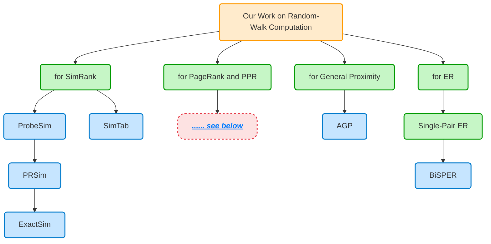
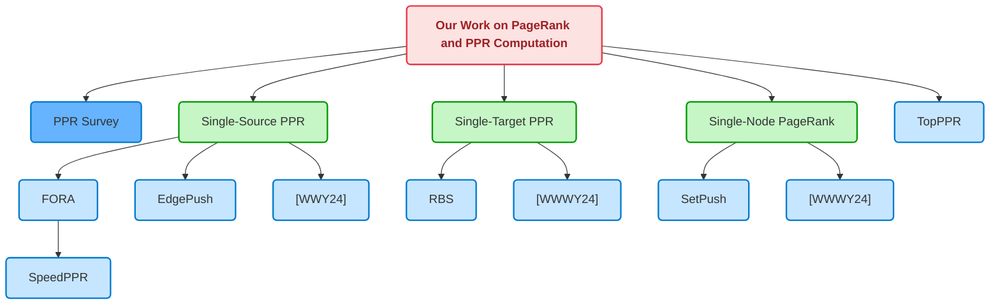





> <b style="color: blue">Random-walk probabilities</b> on graphs serve as a cornerstone in **network analysis**, **graph data mining**, and **graph machine learning**. Their further applications span diverse domains, including information retrieval, recommendation systems, chemistry, biology, and neuroscience.
> 
> 
> This project focuses on **efficient computation and approximation** of random-walk probabilities, a subject of both theoretical and practical significance. We mainly concentrate on optimizing algorithms to compute widely-used random-walk-based metrics, such as <b style="color: blue">SimRank</b>, <b style="color: blue">PageRank</b>, <b style="color: blue">Personalized PageRank (PPR)</b>, and <b style="color: blue">Effective Resistance (ER)</b>.
> 
> 
> Our work improves the computational complexity of computing these quantities, and we also conduct empirical evaluations to demonstrate the efficiency and effectiveness of our approaches in real-world applications, including **local graph clustering** and **graph neural networks**.
{: .block-tip }



<a name="PPR" style="position: relative;top: -80px;"></a>







### ProbeSim: Scalable Single-Source and Top-$$k$$ SimRank Computations on Dynamic Graphs [[VLDB 2017](https://dl.acm.org/doi/10.14778/3151113.3151115)]

<p>
  <a href="https://doi.org/10.14778/3151113.3151115">
    
  </a>
  <a href="http://arxiv.org/abs/1709.06955">
    
  </a>
  <a href="https://github.com/dokirabbithole/ProbeSim_vldb_pub">
    
  </a>
  <a href="https://github.com/dokirabbithole/ProbeSim_vldb_pub/stargazers">
    
  </a>
</p>



#### Citation

```bibtex
@article{liu2017probesim,
  author       = {Yu Liu and
                  Bolong Zheng and
                  Xiaodong He and
                  Zhewei Wei and
                  Xiaokui Xiao and
                  Kai Zheng and
                  Jiaheng Lu},
  title        = {ProbeSim: Scalable Single-Source and Top-k SimRank Computations on Dynamic Graphs},
  journal      = {Proceedings of the VLDB Endowment},
  volume       = {11},
  number       = {1},
  pages        = {14--26},
  year         = {2017},
  url          = {http://www.vldb.org/pvldb/vol11/p14-liu.pdf},
  doi          = {10.14778/3151113.3151115}
}
```

---

### PRSim: Sublinear Time SimRank Computation on Large Power-Law Graphs [[SIGMOD 2019](https://dl.acm.org/doi/10.1145/3299869.3319873)]

<p>
  <a href="https://doi.org/10.1145/3299869.3319873">
    
  </a>
  <a href="http://arxiv.org/abs/1905.02354">
    
  </a>
  <a href="https://github.com/wzskytop/PRSim-Code">
    
  </a>
  <a href="https://github.com/wzskytop/PRSim-Code/stargazers">
    
  </a>
</p>



#### Citation

```bibtex
@inproceedings{wei2019prsim,
  author       = {Zhewei Wei and
                  Xiaodong He and
                  Xiaokui Xiao and
                  Sibo Wang and
                  Yu Liu and
                  Xiaoyong Du and
                  Ji-Rong Wen},
  title        = {PRSim: Sublinear Time SimRank Computation on Large Power-Law Graphs},
  booktitle    = {Proceedings of the 2019 International Conference on Management of
                  Data},
  pages        = {1042--1059},
  year         = {2019},
  url          = {https://doi.org/10.1145/3299869.3319873},
  doi          = {10.1145/3299869.3319873}
}
```

---

### SimTab: Accuracy-Guaranteed SimRank Queries Through Tighter Confidence Bounds and Multi-Armed Bandits [[VLDB 2020](https://doi.org/10.14778/3407790.3407819)]

<p>
  <a href="https://doi.org/10.14778/3407790.3407819">
    
  </a>
</p>



#### Citation

```bibtex
@article{liu2020simtab,
  author       = {Yu Liu and
                  Lei Zou and
                  Qian Ge and
                  Zhewei Wei},
  title        = {SimTab: Accuracy-Guaranteed SimRank Queries through Tighter Confidence
                  Bounds and Multi-Armed Bandits},
  journal      = {Proceedings of the VLDB Endowment},
  volume       = {13},
  number       = {11},
  pages        = {2202--2214},
  year         = {2020},
  url          = {http://www.vldb.org/pvldb/vol13/p2202-liu.pdf},
  doi          = {10.14778/3407790.3407819}
}
```

---

### Exact Single-Source SimRank Computation on Large Graphs [[SIGMOD 2020](https://dl.acm.org/doi/10.1145/3318464.3389781)], ExactSim: Benchmarking Single-Source SimRank Algorithms with High-Precision Ground Truths [[The VLDB Journal 2021](https://link.springer.com/article/10.1007/s00778-021-00672-7)]

<p>
  <a href="https://doi.org/10.1145/3318464.3389781">
    
  </a>
  <a href="http://arxiv.org/abs/2004.03493">
    
  </a>
  <a href="https://github.com/wanghzccls/ExactSim">
    
  </a>
  <a href="https://github.com/wanghzccls/ExactSim/stargazers">
    
  </a>
</p>

<p>
  <a href="https://link.springer.com/article/10.1007/s00778-021-00672-7">
    
  </a>
  <a href="https://github.com/wanghzccls/ExactSim">
    
  </a>
  <a href="https://github.com/wanghzccls/ExactSim/stargazers">
    
  </a>
</p>

> We propose <b style="color: blue">ExactSim</b>, the first algorithm that enables <b style="color: blue">probabilistic exact single-source SimRank queries</b> on large graphs. ExactSim can provide the ground truth with a precision up to $$7$$ decimal places for single-source SimRank queries on large graphs within a reasonable query time. With the ground truths computed by ExactSim, we conduct the first experimental study of the accuracy/cost trade-offs of existing approximate SimRank algorithms on large graphs.
{: .block-tip }





#### Citations

```bibtex
@inproceedings{wang2020exact,
  author       = {Hanzhi Wang and
                  Zhewei Wei and
                  Ye Yuan and
                  Xiaoyong Du and
                  Ji-Rong Wen},
  title        = {Exact Single-Source SimRank Computation on Large Graphs},
  booktitle    = {Proceedings of the 2020 International Conference on Management of
                  Data},
  pages        = {653--663},
  year         = {2020},
  url          = {https://doi.org/10.1145/3318464.3389781},
  doi          = {10.1145/3318464.3389781}
}

@article{wang2021exactsim,
  author       = {Hanzhi Wang and
                  Zhewei Wei and
                  Yu Liu and
                  Ye Yuan and
                  Xiaoyong Du and
                  Ji-Rong Wen},
  title        = {ExactSim: benchmarking single-source SimRank algorithms with high-precision
                  ground truths},
  journal      = {The VLDB Journal},
  volume       = {30},
  number       = {6},
  pages        = {989--1015},
  year         = {2021},
  url          = {https://doi.org/10.1007/s00778-021-00672-7},
  doi          = {10.1007/S00778-021-00672-7}
}
```





### Efficient Algorithms for Personalized PageRank Computation: A Survey [[TKDE 2024](https://ieeexplore.ieee.org/document/10471277)]

<p>
  <a href="https://arxiv.org/abs/2403.05198">
    
  </a>
</p>

> This <b style="color: blue">survey paper</b> provides a systematic and comprehensive review of several <b style="color: blue">basic techniques</b> and <b style="color: blue">recent algorithms</b> for PPR computation **from an algorithmic perspective**.
{: .block-tip }



#### Citation

```bibtex
@article{yang2024efficient,
  author       = {Mingji Yang and
                  Hanzhi Wang and
                  Zhewei Wei and
                  Sibo Wang and
                  Ji-Rong Wen},
  title        = {Efficient Algorithms for Personalized PageRank Computation: A Survey},
  journal      = {IEEE Transactions on Knowledge and Data Engineering},
  volume       = {36},
  number       = {9},
  pages        = {4582--4602},
  year         = {2024},
  doi          = {10.1109/TKDE.2024.3376000}
}
```





### FORA: Simple and Effective Approximate Single-Source Personalized PageRank [[KDD 2017](https://dl.acm.org/doi/10.1145/3097983.3098072)], Efficient Algorithms for Approximate Single-Source Personalized PageRank Queries [[TODS 2019](https://dl.acm.org/doi/10.1145/3360902)]

<p>
  <a href="https://doi.org/10.1145/3097983.3098072">
    
  </a>
  <a href="https://github.com/wangsibovictor/fora">
    
  </a>
  <a href="https://github.com/wangsibovictor/fora/stargazers">
    
  </a>
</p>


<p>
  <a href="https://doi.org/10.1145/3360902">
    
  </a>
  <a href="https://arxiv.org/abs/1908.10583">
    
  </a>
  <a href="https://github.com/wangsibovictor/fora">
    
  </a>
  <a href="https://github.com/wangsibovictor/fora/stargazers">
    
  </a>
</p>





#### Citations

```bibtex
@inproceedings{wang2017fora,
  author       = {Sibo Wang and
                  Renchi Yang and
                  Xiaokui Xiao and
                  Zhewei Wei and
                  Yin Yang},
  title        = {FORA: Simple and Effective Approximate Single-Source Personalized PageRank},
  booktitle    = {Proceedings of the 23rd ACM SIGKDD Conference on Knowledge Discovery and Data Mining},
  pages        = {505--514},
  year         = {2017},
  url          = {https://doi.org/10.1145/3097983.3098072},
  doi          = {10.1145/3097983.3098072}
}

@article{wang2019efficient,
  author       = {Sibo Wang and
                  Renchi Yang and
                  Runhui Wang and
                  Xiaokui Xiao and
                  Zhewei Wei and
                  Wenqing Lin and
                  Yin Yang and
                  Nan Tang},
  title        = {Efficient Algorithms for Approximate Single-Source Personalized PageRank Queries},
  journal      = {ACM Transactions on Database Systems},
  volume       = {44},
  number       = {4},
  pages        = {18:1--18:37},
  year         = {2019},
  url          = {https://doi.org/10.1145/3360902},
  doi          = {10.1145/3360902}
}
```





### Edge-based Local Push for Personalized PageRank [[VLDB 2022](https://dl.acm.org/doi/10.14778/3523210.3523216)]

<p>
  <a href="https://doi.org/10.14778/3523210.3523216">
    
  </a>
  <a href="https://arxiv.org/abs/2203.07937">
    
  </a>
  <a href="https://github.com/wanghzccls/EdgePush">
    
  </a>
  <a href="https://github.com/wanghzccls/EdgePush/stargazers">
    
  </a>
</p>

> The state-of-the-art algorithm, LocalPush, for Personalized PageRank computation can be rather inefficient on <b style="color: blue">weighted graphs</b>. In this paper, we propose an <b style="color: blue">Edge-based Push Method (EdgePush)</b>, which decomposes the push operation of LocalPush into separate edge-based push operations and achieves superior query efficiency over LocalPush on weighted graphs.
{: .block-tip }



#### Citation

```bibtex
@article{wang2022edgebased,
  author       = {Hanzhi Wang and
                  Zhewei Wei and
                  Junhao Gan and
                  Ye Yuan and
                  Xiaoyong Du and
                  Ji-Rong Wen},
  title        = {Edge-based Local Push for Personalized PageRank},
  journal      = {Proceedings of the VLDB Endowment},
  volume       = {15},
  number       = {7},
  pages        = {1376--1389},
  year         = {2022},
  url          = {https://www.vldb.org/pvldb/vol15/p1376-wang.pdf},
  doi          = {10.14778/3523210.3523216}
}
```





### Approximating Single-Source Personalized PageRank with Absolute Error Guarantees [[ICDT 2024](https://drops.dagstuhl.de/entities/document/10.4230/LIPIcs.ICDT.2024.9)]

<p>
  <a href="https://doi.org/10.4230/LIPIcs.ICDT.2024.9">
    
  </a>
  <a href="https://arxiv.org/abs/2401.01019">
    
  </a>
</p>

> This paper proposes new algorithms to improve the upper bounds for <b style="color: blue">approximating Single-Source Personalized PageRank</b> with <b style="color: blue">(degree-normalized) absolute error guarantees</b> on various graphs.
{: .block-tip }



#### Citation

```bibtex
@inproceedings{wei2024approximating,
  author       = {Zhewei Wei and
                  Ji-Rong Wen and
                  Mingji Yang},
  title        = {Approximating Single-Source Personalized PageRank with Absolute Error
                  Guarantees},
  booktitle    = {Proceedings of the 27th International Conference on Database Theory},
  volume       = {290},
  pages        = {9:1--9:19},
  year         = {2024},
  url          = {https://doi.org/10.4230/LIPIcs.ICDT.2024.9},
  doi          = {10.4230/LIPICS.ICDT.2024.9}
}
```





### Personalized PageRank to a Target Node, Revisited [[KDD 2020](https://dl.acm.org/doi/10.1145/3394486.3403108)]

<p>
  <a href="https://doi.org/10.1145/3394486.3403108">
    
  </a>
  <a href="https://arxiv.org/abs/2006.11876">
    
  </a>
  <a href="https://github.com/wanghzccls/RBS">
    
  </a>
  <a href="https://github.com/wanghzccls/RBS/stargazers">
    
  </a>
</p>

> We propose <b style="color: blue">Randomized Backward Search (RBS)</b>, a novel algorithm that answers <b style="color: blue">approximate single-target personalized PageRank queries</b> (a.k.a. PageRank contribution queries) with **nearly optimal time complexity**.
{: .block-tip }



#### Citation

```bibtex
@inproceedings{wang2020personalized,
  author       = {Hanzhi Wang and
                  Zhewei Wei and
                  Junhao Gan and
                  Sibo Wang and
                  Zengfeng Huang},
  title        = {Personalized PageRank to a Target Node, Revisited},
  booktitle    = {Proceedings of the 26th ACM SIGKDD Conference on Knowledge Discovery and Data Mining},
  pages        = {657--667},
  year         = {2020},
  url          = {https://doi.org/10.1145/3394486.3403108},
  doi          = {10.1145/3394486.3403108}
}
```





### Revisiting Local Computation of PageRank: Simple and Optimal [[STOC 2024](https://dl.acm.org/doi/10.1145/3618260.3649661))]

<p>
  <a href="https://doi.org/10.1145/3618260.3649661">
    
  </a>
  <a href="https://arxiv.org/abs/2403.12648">
    
  </a>
</p>

> We use **simple techniques and analyses** to give <b style="color: blue">matching upper and lower bounds</b> for <b style="color: blue">estimating PageRank contributions and single-node PageRank</b>. Our results for the upper bounds are derived by revisiting the known algorithms of **ApproxContributions** (a.k.a. Backward Push) and **BiPPR**.
{: .block-tip }



#### Citation

```bibtex
@inproceedings{wang2024revisiting,
  author       = {Hanzhi Wang and
                  Zhewei Wei and
                  Ji-Rong Wen and
                  Mingji Yang},
  title        = {Revisiting Local Computation of PageRank: Simple and Optimal},
  booktitle    = {Proceedings of the 56th Annual ACM Symposium on Theory of Computing},
  pages        = {911--922},
  year         = {2024},
  url          = {https://doi.org/10.1145/3618260.3649661},
  doi          = {10.1145/3618260.3649661}
}
```





### Estimating Single-Node PageRank in $$\tilde{O}\left(\min\big\{d_t,\sqrt{m}\big\}\right)$$ Time [[VLDB 2023](https://dl.acm.org/doi/10.14778/3611479.3611500)]

<p>
  <a href="https://doi.org/10.14778/3611479.3611500">
    
  </a>
  <a href="https://arxiv.org/abs/2307.13162">
    
  </a>
  <a href="https://github.com/wanghzccls/SetPush-code">
    
  </a>
  <a href="https://github.com/wanghzccls/SetPush-code/stargazers">
    
  </a>
</p>

> For the problem of estimating a <b style="color: blue">single node's PageRank</b> score in an <b style="color: blue">undirected graph</b>, we tighten the upper bound for query time complexity from $$O\left((nd_t)^{1/2}\right)$$ to $$\textcolor{blue}{O\left(\min\left(d_t, m^{1/2}\right)\right)}$$ (omitting logarithmic factors). Here $$n$$ and $$m$$ denote the number of nodes and edges in the given graph, respectively. $$d_t$$ denotes the degree of the given target node $$t$$.
{: .block-tip }



#### Citation

```bibtex
@article{wang2023estimating,
  author       = {Hanzhi Wang and
                  Zhewei Wei},
  title        = {Estimating Single-Node PageRank in $\tilde{O}\left(\min\big\{d_t,\sqrt{m}\big\}\right)$ Time},
  journal      = {Proceedings of the VLDB Endowment},
  volume       = {16},
  number       = {11},
  pages        = {2949--2961},
  year         = {2023},
  url          = {https://dl.acm.org/doi/10.14778/3611479.3611500},
  doi          = {10.14778/3611479.3611500}
}
```





### TopPPR: Top-$$k$$ Personalized PageRank Queries with Precision Guarantees on Large Graphs [[SIGMOD 2018](https://doi.org/10.1145/3183713.3196920)]

<p>
  <a href="https://doi.org/10.1145/3183713.3196920">
    
  </a>
  <a href="https://github.com/wzskytop/TopPPR">
    
  </a>
  <a href="https://github.com/wzskytop/TopPPR/stargazers">
    
  </a>
</p>



#### Citation

```bibtex
@inproceedings{wei2018topppr,
  author       = {Zhewei Wei and
                  Xiaodong He and
                  Xiaokui Xiao and
                  Sibo Wang and
                  Shuo Shang and
                  Ji-Rong Wen},
  title        = {TopPPR: Top-k Personalized PageRank Queries with Precision Guarantees on Large Graphs},
  booktitle    = {Proceedings of 2018 ACM Conference on Management of Data},
  pages        = {441--456},
  year         = {2018},
  url          = {https://doi.org/10.1145/3183713.3196920},
  doi          = {10.1145/3183713.3196920}
}
```





### Approximate Graph Propagation [[KDD 2021](https://dl.acm.org/doi/10.1145/3447548.3467243)]

<p>
  <a href="https://doi.org/10.1145/3447548.3467243">
    
  </a>
  <a href="https://arxiv.org/abs/2106.03058">
    
  </a>
  <a href="https://github.com/wanghzccls/AGP-Approximate_Graph_Propagation">
    
  </a>
  <a href="https://github.com/wanghzccls/AGP-Approximate_Graph_Propagation/stargazers">
    
  </a>
</p>

> We propose <b style="color: blue">Approximate Graph Propagation (AGP)</b>, a unified randomized algorithm that computes <b style="color: blue">various proximity queries</b> and <b style="color: blue">GNN feature propagation</b> with **almost optimal time complexity**.
{: .block-tip }



#### Citation

```bibtex
@inproceedings{wang2021approximate,
  author       = {Hanzhi Wang and
                  Mingguo He and
                  Zhewei Wei and
                  Sibo Wang and
                  Ye Yuan and
                  Xiaoyong Du and
                  Ji-Rong Wen},
  title        = {Approximate Graph Propagation},
  booktitle    = {Proceedings of the 27th ACM SIGKDD Conference on Knowledge Discovery and Data Mining},
  pages        = {1686--1696},
  year         = {2021},
  url          = {https://doi.org/10.1145/3447548.3467243},
  doi          = {10.1145/3447548.3467243}
}
```





### Mixing Time Matters: Accelerating Effective Resistance Estimation via Bidirectional Method [KDD 2025]

<p>
  <a href="https://github.com/GuanyuCui/BiSPER">
    
  </a>
  <a href="https://github.com/GuanyuCui/BiSPER/stargazers">
    
  </a>
</p>






