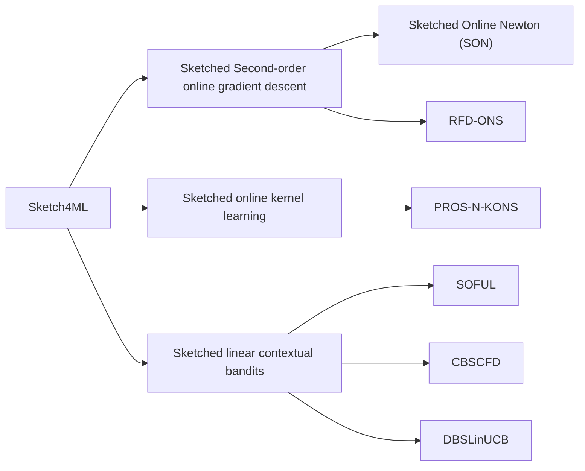





> This project focuses on the <b style="color: blue">streaming data algorithms</b>, which maintain a small data structure in memory, and the applications of these algorithms in machine learning, which are called <b style="color: blue;">Sketch4ML</b>. The streaming algorithms can be used to optimize the machine learning algorithms, which are usually memory-intensive and time-consuming. 
{: .block-tip }

## Streaming algorithm

In computer science, **streaming algorithms** are algorithms for processing data streams in which the input is presented as a sequence of items and can be examined in only a few passes, typically just one. These algorithms are characterized by the following properties:

* Operate with limited computational/storage resources, generally logarithmic in the size of the stream and/or in the maximum value in the stream.
* Have limited processing time per item.
* To reduce computational/storage overhead, a certain error or/and fault probability can be tolerated.

As a result of these constraints, streaming algorithms often produce approximate answers based on a **sketch** of the data stream. 

### Books and Papers

<ul>
  <li>
    <dt><a href="https://www.dimacs.rutgers.edu/~graham/ssbd.html"><i>Small Summaries for Big Data</i></a>, Graham Cormode and Ke Yi, Cambridge University Press, 2020 </dt>
    <dd>This book provides a comprehensive introduction to many classic summary and sketch algorithms for a range of streaming data structures - sets, multisets, ordered data, vector, matrix, graph, and more. This book also offers detailed mathematical analysis of algorithm complexity, approximation error, and statistical properties.</dd>
  </li>
  <li>
    <dt><a href="https://dl.acm.org/doi/10.1561/0400000060"><i>Sketching as a Tool for Numerical Linear Algebra</i></a>, David P. Woodruff, 2014</dt>
    <dd>This survey highlights matrix sketching algorithm for a lot of problems of numerical linear algebra - least squares as well as robust regression problems, low rank approximation, and graph sparsification. </dd>
  </li>
  <li>
    <dt><a href="https://dl.acm.org/doi/10.1145/2487575.2487623"><i>Frequent Directions : Simple and Deterministic Matrix Sketching</i></a>, Edo Liberty, 2013</dt>
    <dd>This paper introduces the Frequent Directions algorithm, which is a simple and deterministic matrix sketching algorithm that can be used to approximate the covariance matrix of a data stream. </dd>
  </li>
</ul>

### Our Work



## Sketch for Machine Learning (Sketch4ML)

**Sketch for Machine Learning (Sketch4ML)** is a technique that uses streaming algorithms to optimize machine learning algorithms. For example, matrix sketching has been employed to accelerate **second-order online gradient descent** (SON, [Luo et al., 2016](https://papers.nips.cc/paper_files/paper/2016/hash/15de21c670ae7c3f6f3f1f37029303c9-Abstract.html); RFD-ONS, [Luo et al., 2019](https://www.jmlr.org/papers/v20/17-773.html)), **online kernel learning** ([Calandriello et al., 2017](https://proceedings.neurips.cc/paper/2017/hash/366f0bc7bd1d4bf414073cabbadfdfcd-Abstract.html)), and **linear contextual bandits** (SOFUL, [Kuzborskij et al., 2019](https://proceedings.mlr.press/v89/kuzborskij19a.html); CBSCFD [Chen et al., 2020](https://www.ijcai.org/Proceedings/2020/0588.pdf); DBSLinUCB), as shown in the following figure.





<!-- Badges -->

  
  
  
  

In this work, we proposes the optimal matrix sketch algorithm DS-FD on sliding windows, which achives the lower bound of space complexity for solving the matrix sketching problem over sliding windows. The paper addressed the open question of the lower bounds of space complexity for any deterministic algorithms solving the matrix sketching problem over sliding windows. The answer to this open problem confirms that our DS-FD algorithm is optimal in terms of space complexity.

The paper is accepted by VLDB 2024 and nominated for the Best Research Paper. If you are interested in the details, please refer to the [paper](https://doi.org/10.14778/3665844.3665847), [arxiv](https://arxiv.org/abs/2405.07792) or the [code](https://github.com/yinhanyan/DS-FD).



### Problem Definition

### Method

### Results

  

  The space upper bound of DS-FD and lower bound in various senarios.





TBD



