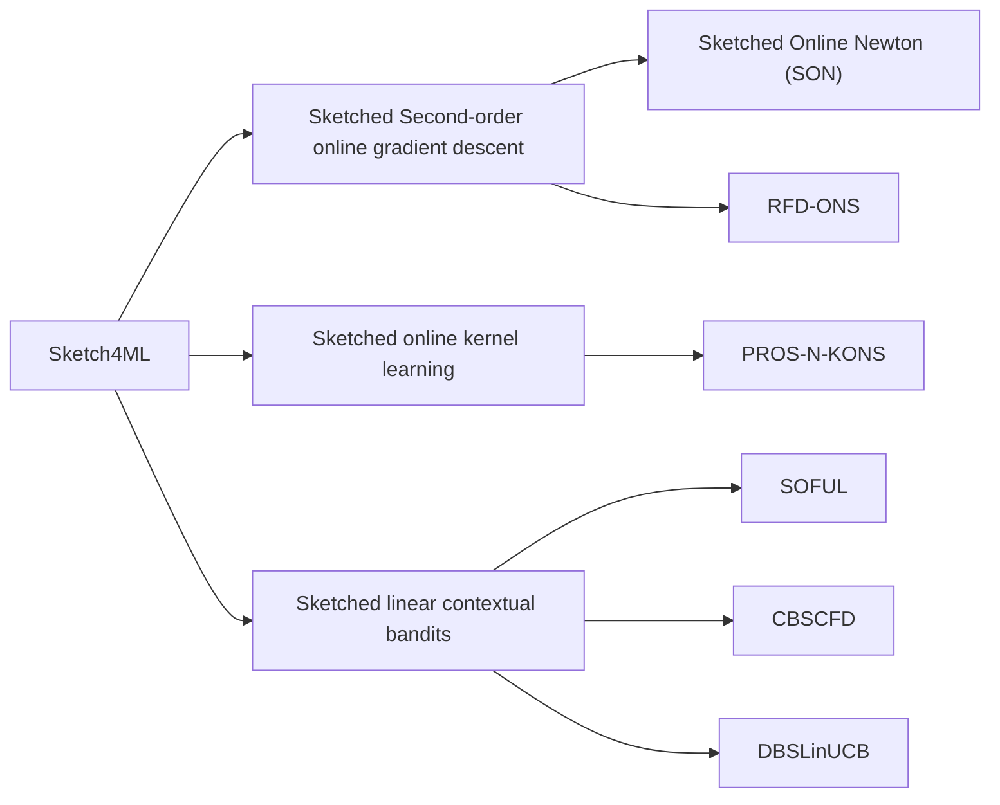





> This project focuses on the <b style="color: blue">streaming data algorithms</b>, which maintain a small data structure in memory, and the applications of these algorithms in machine learning, which are called <b style="color: blue;">Sketch4ML</b>. The streaming algorithms can be used to optimize the machine learning algorithms, which are usually memory-intensive and time-consuming. 
{: .block-tip }

## Streaming algorithm

In computer science, **streaming algorithms** are algorithms for processing data streams in which the input is presented as a sequence of items and can be examined in only a few passes, typically just one. These algorithms are characterized by the following properties:

* Operate with limited computational/storage resources, generally logarithmic in the size of the stream and/or in the maximum value in the stream.
* Have limited processing time per item.
* To reduce computational/storage overhead, a certain error or/and fault probability can be tolerated.

As a result of these constraints, streaming algorithms often produce approximate answers based on a **sketch** of the data stream. 

### Books and Papers

<ul>
  <li>
    <dt><a href="https://www.dimacs.rutgers.edu/~graham/ssbd.html"><i>Small Summaries for Big Data</i></a>, Graham Cormode and Ke Yi, Cambridge University Press, 2020 </dt>
    <dd>This book provides a comprehensive introduction to many classic summary and sketch algorithms for a range of streaming data structures - sets, multisets, ordered data, vector, matrix, graph, and more. This book also offers detailed mathematical analysis of algorithm complexity, approximation error, and statistical properties.</dd>
  </li>
  <li>
    <dt><a href="https://dl.acm.org/doi/10.1561/0400000060"><i>Sketching as a Tool for Numerical Linear Algebra</i></a>, David P. Woodruff, 2014</dt>
    <dd>This survey highlights matrix sketching algorithm for a lot of problems of numerical linear algebra - least squares as well as robust regression problems, low rank approximation, and graph sparsification. </dd>
  </li>
  <li>
    <dt><a href="https://dl.acm.org/doi/10.1145/2487575.2487623"><i>Frequent Directions : Simple and Deterministic Matrix Sketching</i></a>, Edo Liberty, 2013</dt>
    <dd>This paper introduces the Frequent Directions algorithm, which is a simple and deterministic matrix sketching algorithm that can be used to approximate the covariance matrix of a data stream. </dd>
  </li>
</ul>

### Our Work



## Sketch for Machine Learning (Sketch4ML)

**Sketch for Machine Learning (Sketch4ML)** is a technique that uses streaming algorithms to optimize machine learning algorithms. For example, matrix sketching has been employed to accelerate **second-order online gradient descent** (SON, [Luo et al., 2016](https://papers.nips.cc/paper_files/paper/2016/hash/15de21c670ae7c3f6f3f1f37029303c9-Abstract.html); RFD-ONS, [Luo et al., 2019](https://www.jmlr.org/papers/v20/17-773.html)), **online kernel learning** ([Calandriello et al., 2017](https://proceedings.neurips.cc/paper/2017/hash/366f0bc7bd1d4bf414073cabbadfdfcd-Abstract.html)), and **linear contextual bandits** (SOFUL, [Kuzborskij et al., 2019](https://proceedings.mlr.press/v89/kuzborskij19a.html); CBSCFD [Chen et al., 2020](https://www.ijcai.org/Proceedings/2020/0588.pdf); DBSLinUCB), as shown in the following figure.







<!-- Badges -->
<p>
  <a href="https://doi.org/10.14778/3665844.3665847">
    
  </a>
  <a href="https://arxiv.org/abs/2405.07792">
    
  </a>
  <a href="https://github.com/yinhanyan/DS-FD">
    
  </a>
  <a href="https://github.com/yinhanyan/DS-FD/stargazers">
    
  </a>
</p>

In this work, we proposes the optimal matrix sketch algorithm DS-FD on sliding windows, which achives the lower bound of space complexity for solving the matrix sketching problem over sliding windows. The paper addressed the open question of the lower bounds of space complexity for any deterministic algorithms solving the matrix sketching problem over sliding windows. The answer to this open problem confirms that our DS-FD algorithm is optimal in terms of space complexity.

The paper is accepted by VLDB 2024 and nominated for the Best Research Paper. If you are interested in the details, please refer to the [paper](https://doi.org/10.14778/3665844.3665847), [arxiv](https://arxiv.org/abs/2405.07792) or the [code](https://github.com/yinhanyan/DS-FD).



### Problem Definition

(**Optimal Matrix Sketching over Sliding Windows**) Suppose we have a data stream where each item is in the set $$\mathbb{R}^{d}$$. Given the error parameter $$\varepsilon$$ and window size $$N$$, the goal is to maintain a matrix sketch $$\kappa$$ such that, at the current time $$T$$, $$\kappa$$ can return an approximation $$\boldsymbol{B}_W$$ for the matrix $$\boldsymbol{A}_W=\boldsymbol{A}_{T-N,T} \in \mathbb{R}^{N\times d}$$, stacked by the recent $$N$$ items. The approximation quality is measured by the *covariance error*, such that:

 $$ 
    \mathbf{cova-error}(\boldsymbol{A}_W, \boldsymbol{B}_W) = \lVert \boldsymbol{A}^\top_W\boldsymbol{A}_W - \boldsymbol{B}^\top_W\boldsymbol{B}_W\rVert_2 \le \varepsilon \lVert\boldsymbol{A}_W\rVert_F^2,
  $$

where $$N$$ bounds the maximum size of window $$W$$.

### Method

We propose the DS-FD algorithm, which is optimal in terms of space complexity for solving the matrix sketching problem over sliding windows. 

#### DS-FD Algorithm for *Normalized Sequence-based* Sliding Windows

First, we take a step back and consider a simplified scenario where the norm of each row is constantly 1, and each update occupies one timestamp. The window length is set to $$N$$. We refer to this as the *sequence-based* and *normalized* sliding window model. To handle this model, we maintain a sketch matrix $$\boldsymbol{C}$$ and a queue $$\mathcal{S}$$. When a row vector $$\boldsymbol{a}$$ arrives, we 

Step 1: First remove any outdated elements from the queue $$\mathcal{S}$$. Next, we concatenate the matrix $$\boldsymbol{C}$$ with the new vector $$\boldsymbol{a}$$.

<div class="w-75 mx-auto">
  
</div>

Step 2: If the rank of $$\boldsymbol{C}$$ is more than $$\ell$$, we perform Singular Value Decomposition (SVD) on the concatenated matrix $$\boldsymbol{C}$$ and get $$\mathtt{svd}(\boldsymbol{C})=(\boldsymbol{U},\boldsymbol{\Sigma},\boldsymbol{V}^\top)$$.

If the top singular value $$\sigma_1^2>\varepsilon N$$, we drop the top singular value $$\sigma_1$$ from $$\boldsymbol{\Sigma}$$ and the corresponding right singular vector $$\boldsymbol{v}_1$$ ffrom $$\boldsymbol{V}$$, and save the $$\sigma_1 \cdot \boldsymbol{v}_1^\top$$ with the current timestamp $$t$$ to the queue $$\mathcal{S}$$. (The saved timestamp is used to delete outdated elements in step 1 later.) We refer to this as **dump operation**. The new sketch matrix $$\boldsymbol{C}=\boldsymbol{\Sigma}[2:,\:]\boldsymbol{V}[2:,\:]^\top$$. 

<div class="w-75 mx-auto">
  
</div>

Otherwise ($$\sigma_1^2\le\varepsilon N$$), we update the sketch matrix $$\boldsymbol{C}$$ using the **FD reduce operation** as in [[1]](#ref1). That is, $$\boldsymbol{C}=\sqrt{\boldsymbol{\Sigma}^2-\sigma^2_{\ell+1}\boldsymbol{I}_{\ell+1}}\boldsymbol{V}^\top$$.

<div class="w-75 mx-auto">
  
</div>

#### Generalization to *Unnormalized* and *Time-based* Sliding Windows

We then extend DS-FD to handle more general scenarios when the rows are *unnormalized*, where the norm of each row vector lies within the range of $$1$$ to $$R$$ ($$\lVert \boldsymbol{a}_i\rVert \in [1,R]$$), or in a *time-based* window model, where each timestamp may contain zero updates ($$\lVert \boldsymbol{a}_i\rVert \in {0} \cup [1,R]$$). In these scenarios, we can first normalize the vectors and treat the update as $$\lVert \boldsymbol{a}_i\rVert$$ time updates of the normalized vector $$\boldsymbol{a}_i$$ ($$\lVert \boldsymbol{a}_i\rVert \times \frac{\boldsymbol{a}_i}{\lVert \boldsymbol{a}_i\rVert}$$). This converts the problem into the *normalized sequence-based* model, but with a *variable window length*. The minimum window length is $$N$$, and the maximum is $$NR$$.

To manage this, we initialize $$\log ⁡R$$ parallel DS-FD data structures, each with an exponentially increasing threshold to trigger the **dump operation**. The queue at each level stores no more than $${1\over\varepsilon}$$ snapshots. As a result, there will always be one DS-FD level that returns a qualified sketch at any time, and the space complexity naturally increases by a logarithm factor.

<div class="w-75 mx-auto">
  
</div>
<div class="caption">
  DS-FD algorithm for *unnormalized* and *time-based* sliding windows model
</div>

### Results

#### Optimal Space Complexity

Furthermore, we were surprised to discover that the space lower bound for the matrix sketching problem in the sliding window model is of the same order as the space complexity of DS-FD. This indicates that our DS-FD algorithm is optimal in terms of space overhead for solving the problem.

| sketch $$\kappa$$ | Sequence-based<br>(normalized) | Sequence-based<br>(unnormalized) | Time-based<br>(normalized) | Time-based<br>(unnormalized) |
|-----------------|----------------------------|-------------------------------|-------------------------|----------------------------|
| Sampling | $$O\left(\frac{d}{\varepsilon^2} \log N\right)$$ * | $$O\left(\frac{d}{\varepsilon^2} \log NR\right)$$ * | $$O\left(\frac{d}{\varepsilon^2} \log N\right)$$ * | $$O\left(\frac{d}{\varepsilon^2} \log NR\right)$$ * |
| LM-FD[[2]](#ref2) | $$O\left(\frac{d}{\varepsilon^2}\right)$$ | $$O\left(\frac{d}{\varepsilon^2} \log R\right)$$ | $$O\left(\frac{d}{\varepsilon^2} \log \varepsilon N\right)$$ | $$O\left(\frac{d}{\varepsilon^2} \log \varepsilon NR\right)$$ |
| DI-FD[[2]](#ref2) | $$O\left(\frac{d}{\varepsilon} \log \frac{1}{\varepsilon}\right)$$ | $$O\left(\frac{Rd}{\varepsilon} \log \frac{R}{\varepsilon}\right)$$ | - | - |
| **DS-FD<br>(This work)** | $$O\left(\frac{d}{\varepsilon}\right)$$ | $$O\left(\frac{d}{\varepsilon} \log R\right)$$ | $$O\left(\frac{d}{\varepsilon} \log \varepsilon N\right)$$ | $$O\left(\frac{d}{\varepsilon} \log \varepsilon NR\right)$$ |
| **Lower bound<br>(This work)** | $$\Omega\left(\frac{d}{\varepsilon}\right)$$ | $$\Omega\left(\frac{d}{\varepsilon} \log R\right)$$ | $$\Omega\left(\frac{d}{\varepsilon} \log \varepsilon N\right)$$ | $$\Omega\left(\frac{d}{\varepsilon} \log \varepsilon NR\right)$$ |

<div class="caption">
  Given the dimension d of each row vector, the upper bound of relative covariance error 𝜀, and the size of the sliding window N, this table presents an overview of space complexities for algorithms addressing matrix sketching over sliding windows. An asterisk (*) indicates that the space complexity is the expected value when it is a random variable. 
</div>

In our proof of the lower bound, we carefully constructed challenging adversarial inputs against the algorithms. Our approach incorporates techniques used in the proof of the lower bound in the streaming model, as outlined in the paper on Frequent Directions[[1]](#ref1).

#### Experiments

We implemented all the algorithms across various data streams, both synthetic and real-world. We recorded the maximum error, average error, and the corresponding maximum space cost under different parameter settings. Our observations show that DS-FD achieves the best trade-off between error and space cost, as well as between update time and query time. These results confirm the theoretical analysis and the efficiency of our algorithm.

<div class="w-75 mx-auto">
  
</div>
<div class="caption">
  Maximum error and maximum space cost of different algorithms under different data streams.
</div>

### Citation

```bibtex
@article{10.14778/3665844.3665847,
  author = {Yin, Hanyan and Wen, Dongxie and Li, Jiajun and Wei, Zhewei and Zhang, Xiao and Huang, Zengfeng and Li, Feifei},
  title = {Optimal Matrix Sketching over Sliding Windows},
  year = {2024},
  issue_date = {May 2024},
  publisher = {VLDB Endowment},
  volume = {17},
  number = {9},
  issn = {2150-8097},
  url = {https://doi.org/10.14778/3665844.3665847},
  doi = {10.14778/3665844.3665847},
  journal = {Proc. VLDB Endow.},
  month = aug,
  pages = {2149–2161},
  numpages = {13}
}
```

### References

<ol>
<li><a name="ref1"></a>Edo Liberty. 2013. <a href="https://dl.acm.org/doi/10.1145/2487575.2487623">Simple and deterministic matrix sketching</a>. In <cite>Proceedings of the 19th ACM SIGKDD international conference on Knowledge discovery and data mining (KDD '13)</cite>. Association for Computing Machinery, New York, NY, USA, 581–588. https://doi.org/10.1145/2487575.2487623</li>
<li><a name="ref2"></a>Zhewei Wei, Xuancheng Liu, Feifei Li, Shuo Shang, Xiaoyong Du, and Ji-Rong Wen. 2016. <a href="https://dl.acm.org/doi/10.1145/2882903.2915228">Matrix Sketching Over Sliding Windows</a>. In <cite>Proceedings of the 2016 International Conference on Management of Data (SIGMOD '16)</cite>. Association for Computing Machinery, New York, NY, USA, 1465–1480. https://doi.org/10.1145/2882903.2915228</li>
</ol>





<p>
  <a href="https://arxiv.org/abs/2410.10258">
    
  </a>
</p>

In this work, we investigates matrix sketching techniques in linear bandit settings. Current sketch-based methods can reduce time complexity but suffer from critical issues, such as linear regret when the covariance matrix’s spectral tail does not decrease fast enough. To address this, we propose Dyadic Block Sketching, an adaptive streaming matrix sketching approach that manages sketch size dynamically to avoid linear regret. This method allows sublinear regret without requiring prior knowledge of the covariance matrix. 

### Problem Definition

In the linear bandit setting, when a player selects an action $$\boldsymbol{x}_t$$, they receive a reward $$r_t = \boldsymbol{x}_t^{\top} \boldsymbol{\theta}_{\star} + z_t$$, where $$\boldsymbol{\theta}_{\star}$$ is an unknown vector, and $$z_t$$ is a random noise. Traditional algorithms use **regularized least squares (RLS)** to estimate $$\boldsymbol{\theta}_{\star}$$ through the matrix $$\boldsymbol{X}_{(t)}^\top\boldsymbol{X}_{(t)}$$ and the estimated $$\hat{\boldsymbol{\theta}}_t$$, which involves calculating $$(\boldsymbol{X}_{(t)}^\top\boldsymbol{X}_{(t)})^{-1}$$, the common form of the RLS estimator is defined as:

$$
  \boldsymbol{\theta}= {\color{red}(\boldsymbol{X}_{(t)}^\top\boldsymbol{X}_{(t)} + \lambda\boldsymbol{I})^{-1}}\boldsymbol{X}_{(t)}^\top\boldsymbol{r}
$$

Given $$(\boldsymbol{X}_{(t-1)}^\top\boldsymbol{X}_{(t-1)} + \lambda\boldsymbol{I})^{-1}$$ and $$\boldsymbol{x}_{(t)}$$. The update process to get the red part above

$$
  (\boldsymbol{X}_{(t)}^\top\boldsymbol{X}_{(t)} + \lambda\boldsymbol{I})^{-1}=(\boldsymbol{X}_{(t-1)}^\top\boldsymbol{X}_{(t-1)} + \boldsymbol{x}_{(t)}\boldsymbol{x}_{(t)}^{\top} + \lambda\boldsymbol{I})^{-1}
$$

takes a lot of time, about $$\Omega(d^2)$$, where $$d$$ is the dimension of the data.

To speed this up, sketch-based methods approximate the matrix $$\boldsymbol{X}^{(t)}$$ (containing all actions up to round $$t$$) using a smaller sketch matrix $$\boldsymbol{S}^{(t)}$$, reducing the time complexity. For example, using Frequent Directions (FD), the sketch matrix $$\boldsymbol{S}^{(t)}$$ is updated, and the covariance matrix’s inverse is calculated more efficiently. This reduces the time complexity for matrix-vector operations to $$O(ld)$$ and for matrix-matrix operations to $$O(l^2)$$, where $$l$$ is the sketch size, significantly improving computation from $$\Omega(d^2)$$ to $$O(ld + l^2)$$.

### Current Pitfalls

Our analysis is based on the original Frequent Directions (FD) method. To explain our motivation, we first present the regret bound for the linear bandit using FD. The sum of the squared singular values reduced by FD up to round $$T$$ is denoted by $$ \overline{\sigma} = \sum_{t=1}^{T} \left(\sigma_{l}^{(t)}\right)^2 $$, where $$l$$ is the sketch size. This can be bounded by the *spectral error* $$ \Delta_T $$:

$$
\Delta_T := \min_{k<l}\frac{\left\Vert\boldsymbol{X}^{(T)}-\boldsymbol{X}^{(T)}_{[k]}\right\Vert_F^2}{l-k}.
$$

Consequently, the regret of the sketch-based linear bandit is:

$$
\text{Regret}_T =  \tilde{O}\left((1 + \Delta_T)^{\frac{3}{2}} (l+d\log(1+\Delta_T))\sqrt{T}\right).
$$

If $$\Delta_T = T^{\gamma}$$ and $$\gamma > \frac{1}{3}$$, the regret grows linearly with $$T$$, which is undesirable. This highlights a key issue: the sketch size is crucial. If it's too small to capture the spectral information, linear regret is inevitable.

### Dyadic Block Sketching

We propose Dyadic Block Sketching with a constrained global error bound and provide formal theoretical guarantees. By leveraging Dyadic Block Sketching, we present a framework for efficient sketch-based linear bandits. When the error exceeds a given threshold, a new sketch matrix is created, with its size doubled. The sketch size is adjusted adaptively based on the data, according to a pre-set maximum sketch approximation error. Even in the worst-case scenario, our method can achieve sublinear regret without prior knowledge of the covariance matrix. 

<div class="w-75 mx-auto">
  
</div>
<div class="caption">
  An illustration for Dyadic Block Sketching
</div>

For detailed algorithm and analysis, please refer to the paper:



### Citation

```bibtex
@article{wen2024matrix,
  title={Matrix Sketching in Bandits: Current Pitfalls and New Framework},
  author={Wen, Dongxie and Yin, Hanyan and Zhang, Xiao and Wei, Zhewei},
  journal={arXiv preprint arXiv:2410.10258},
  year={2024}
}
```



